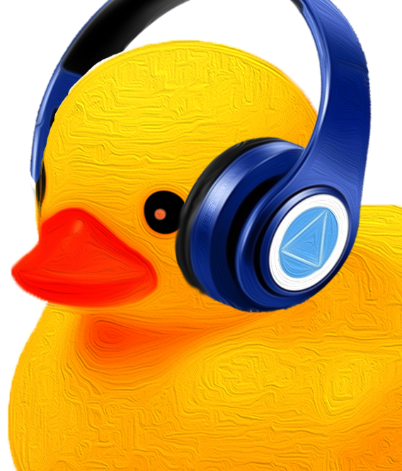

# **DJ Pes**
## Music Bot In Discord

---

## **Version Info**
> ### 0
> > ## **0.0**
> > ### *Task List*
> > | Task | Done? | Know? | Dead Line |
> > | --- | --- | --- | :---: |
> > | Connect to Discord api | [x] | [x] | - |
> > | Get Data From User | [x] | [x] | - |
> > | Queue System Base on Guild | [x] | [x] | - |
> > | (Play Func) check if link | [x] | [x]: src in npm ytdl-core | - |
> > | (Play Func) search in youtube | [x] | [x]: src in npm yt searcher or yt search | - |
> > | (Play Select Func) Get Data From Yt Search List and let Users Select | [x] | [x] | - |
> > | (Play Func) stream music to discord | [x] | [x]: src in npm ytdl-core | - |
> > | if last one leave channel bot pause | [x] | [x] | - |
> > | if last one go to new channel in guil bot chase | [x] | [x] | - |
> > | (Stop Func) Bot Stop Song and Leave Voice Channel | [x] | [x] | - |
> > | (Skip Func) Go to Next Song In queue | [x] | [x] | - |
> > | (Remove Func) Remove Song Out Of queue | [x] | [x] | - |
> > | (Loop Queue Func) Loop Song in queue | [x] | [x] | - |
> > | (Help Func) Send information how to user to User | [x] | [x] | - |
> > (Get Info Func) Send information about app and server to User | [x] | [x] | - |
> > >
> > > ### **0.0.a.0**
> > > ### *Task List*
> > > | Task | Done? | Know? | Dead Line |
> > > |--- | --- | --- | :---: |
> > > | Do Main Task | [ ] | [x] | - |
>
> > ## **0.1**
> > ### *Task List*
> > | Task | Done? | Know? | Dead Line |
> > | --- | --- | --- | :---: |
> > | Organize order permissions to use command | [ ] | [x] | - |
> > | Make Send Back Message format is organized, easy to read. | [ ] | [x] | - |
> > | (Beutiful Send Message) | [ ] | [ ] | - |
> > | improve performance of search, queue and other commands to more fast and not delay | [ ] | [ ] |
> > | (Random Music In Queue Func) | [ ] | [x] | - |
> > | (Ping Commands) | [ ] | [x] | - |
> > | Order Help Commands to send back | [ ] | [ ] | - |
> > > ### **0.1.a.0**
> > > ### *Task List*
> > > | Task | Done? | Know? | Dead Line |
> > > |--- | --- | --- | :---: |
> > > | Do Main Task | [ ] | [x] | - |
---
## **Features**
## &emsp; Now
> Feature | Done? | Result? (1 - 5) | Version |
> | --- | :---: | :---: | --- |
> | Play Func | [x] | - | 0.0.a.0 &rarr; now |
> | Select Func | [x] | - | 0.0.a.0 &rarr; now |
> | Pause Func | [x] | - | 0.0.a.0 &rarr; now |
> | Stop Func | [x] | - | 0.0.a.0 &rarr; now |
> | Skip Func | [x] | - | 0.0.a.0 &rarr; now |
> | Remove Func | [x] | - | 0.0.a.0 &rarr; now  |
> Loop Queue Func | [x] | - | 0.0.a.0 &rarr; now |
> | Help Func | [x] | - | 0.0.a.0 &rarr; now |
> | Get Info Func | [x] | - | 0.0.a.0 &rarr; now |
## &emsp; Future
> Feature | Done? | Result? (1 - 5) | Version |
> | --- | :---: | :---: | --- |
> | Beutiful Send Message | [ ] | - | |
> | Random Music In Queue Func | [x] | - |  |
> | Ping Func | [ ] | - |  |
> | Slash Comand, Interaction Create | [ ] | - | |
> | Button Command | [ ] | - | |
> | create server to manage | [ ] | - |
> | make app and web to control | [ ] | - |

## &emsp; Past
> Feature | Done? | Result? (1 - 5) | Version |
> | --- | :---: | :---: | --- |
